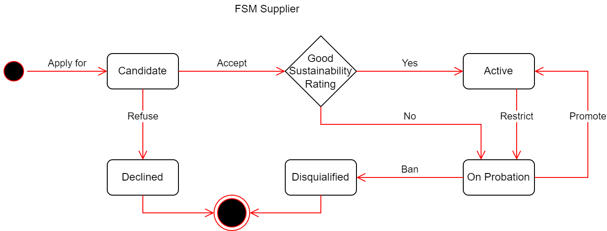

# Technical test for backend developer

Revision #12

## Inditex supplier management

Inditex's supplier management follows the following business flow.

## Supplier life cycle

Any supplier can apply as a candidate to work at Inditex, for this it must provide a set of mandatory minimum data to initialize the application:

- Name
- [DUNS (Data Universal Numbering System)][duns]
- Country
- Annual turnover (in euros)

Upon application, a supervisor may accept or refuse the candidate.

An applicant cannot be accepted as a supplier if the country is on the list of non-approved countries or if its turnover is less than one million euros.
Acceptance of a candidate requires the supervisor to indicate the initial sustainability rating.

The sustainability rating is a grade assigned to the supplier, ranging from A to E, with A being the best possible grade and E the lowest.

An application may be refused at the supervisor's discretion, a declined candidate may reapply again.

A supplier whose sustainability rating is A or B will be considered an Active supplier and will be considered a Probationary supplier if the grade is C, D or E.

A supervisor may ban a supplier on probation, a disqualified supplier will not be allowed to become a supplier again, even by reapplying.

### Rules

- An active candidate is a candidate whose candidacy has not been refused.
- For a DUNS, only one active candidature can exist.
- For a DUNS, only one supplier can exist.
- There cannot be simultaneously an active candidate and a supplier for the same DUNS.
- A supplier can be in 'On Probation' but we need not show this in the API, so api-status will show as 'Active' both for 'Active' and 'On Probation' suppliers.

### Potential suppliers

The system also must answer the question about obtaining the list of potential suppliers for an order.

A supplier can be evaluated if its annual turnover is higher than the cost of the order.

The supplier's score is calculated:
- Supplier annual turnover * 0.1 * constant of the sustainability rating:
  - A -> 1
  - B -> 0.75
  - C -> 0.5
  - D -> 0.25
  - E -> 0.1
- To boost small suppliers in each country, a 25% bonus is applied to all suppliers whose annual turnover is one of the two unique lowest annual turnovers in their country.

> Note: Given the 5 suppliers with the least turnover in a country (s1:200, s2:200, s3:200, s4:210, s5:250).  
> If we were to reward only two suppliers, we would have to exclude one of the 3 that have 200,
> to avoid this we identify the two lowest billings (200, 210) and reward all suppliers with that billing (s1, s2, s3, s4).

> Note: A disqualified supplier cannot be considered a potential supplier.

## Technical test

### Implementation Requirements

The test consists of developing a service to manage Inditex's suppliers according to the above business logic.

An OpenAPI is provided defining the API structure with the following operations:

- Create candidate (Apply for)
  - with: Name, DUNS, Country (ISO 3166-1 alpha-2 code), Annual turnover (in euros)
- Get candidate
  - by DUNS
- Refuse candidate
  - by DUNS
- Accept candidate
  - by DUNS, with: sustainability rating
- Get supplier
  - by DUNS
- Ban supplier
  - by DUNS
- Calculate potential suppliers
  - with: rate

### Items provided

- Base project (spring boot)
  - Implement your solution in 'com.itxiop.tech.supplier.sandbox'
  - A behaviour oriented test is available in 'com.itxiop.tech.supplier.suite'
- OpenAPI describing the possible actions, seen in the previous section.
  - [itx-iop_tech-supplier_flow-main-openapi3_1.yaml](_files/itx-iop_tech-supplier_flow-main-openapi3_1.yaml)
- OpenAPI of the service where you can check the status of a country (viable, banned).
  - [itx-iop_tech-supplier_flow-country-openapi3_1.yaml](_files/itx-iop_tech-supplier_flow-country-openapi3_1.yaml)
  - REST API available in base project.
- Notifications of change in a supplier's sustainability rating.
  - Spring event notifying supplier scoring changes.
    - _com.itxiop.tech.supplier.sustainability.SustainabilityRatingEvent_

> Note: Handle the provided REST API as an external service (integration, test...).

### Considerations

- Implement your solution following DDD principles.
- It is recommended to use an in-memory database as persistence.
- Do not modify existing tests and support classes.
- You can make use of any additional libraries you require if they do not incur licensing issues.
- Due to platform limitations, you cannot include Docker services as part of your solution.
- Consider performance and scalability aspects in your solution.
- Document the aspects that you consider of relevant mention.
- The architecture and implementation of the service will be evaluated.
- Number of vendors is in the range of 100,000 to 1,000,000.
- Code clarity.
- Include tests in your solution of the points that you consider should be tested for Unity and Integration.
- Test case results.

### Approach to the test

This test has several functionalities, some are mandatory, others are optional.

- Mandatory
  - Create candidate
  - Accept candidate
  - Potential suppliers (simplified pagination)
- Optional (ranked in order of importance)
  1. Update sustainability rating (check 'Trigger sustainability rating change' section)
  2. Pagination for Potential Suppliers
  3. Refuse candidate
  4. Ban supplier
  5. Get supplier
  6. Get candidate

> Note regarding "Potential suppliers (simplified pagination)"  
> To comply with the API, the response must be wrapped in a paged structure, but there is no need to implement limit and offset functionality.  
> Provided test suite fits inside the page defined in the API.

The objective of the test is not a complete implementation,
after the mandatory elements choose optional or even improvements on the implementation.

Prioritize your time in the core zone (business logic),
the rest you can have a more relaxed approach.

The resources provided are consistent with each other (OpenAPI, Test Suite),
if something does not work, patch it, and let us know.

### Trigger sustainability rating change

To trigger a change in the sustainability rating of a supplier who launches an event _com.itxiop.tech.supplier.sustainability.SustainabilityRatingEvent_

An REST endpoint is available at _com.itxiop.tech.supplier.sustainability.SustainabilityRatingController_ (POST /sustainability/update),
use it as you need it.

[duns]: https://en.wikipedia.org/wiki/Data_Universal_Numbering_System
